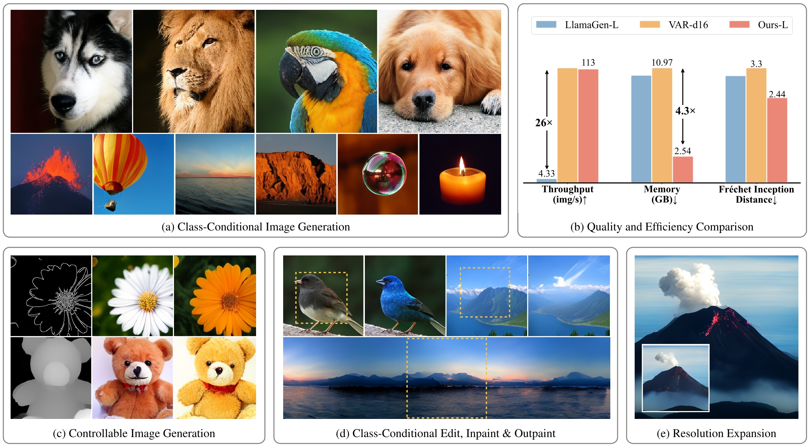

<!-- # ARPG: Autoregressive Image Generation with Randomized Parallel Decoding
 -->
<div align ="center">
<h1>Autoregressive Image Generation with Randomized Parallel Decoding</h3>

[Haopeng Li](https://github.com/hp-l33)<sup>1,\*</sup>, Jinyue Yang<sup>2</sup>, [Guoqi Li](https://casialiguoqi.github.io)<sup>2</sup>, [Huan Wang](https://huanwang.tech)<sup>1,📧</sup>

<sup>1</sup> Westlake University,
<sup>2</sup> Institute of Automation, Chinese Academy of Sciences


[](https://arxiv.org/abs/) [](https://hp-l33.github.io/projects/arpg) [](https://huggingface.co/hp-l33/ARPG)

</div>

<p align="center">

<p>

## News
* **2025-03-xx**: The paper and code are released!


## Introduction
We introduce a novel autoregressive image generation framework named **ARPG**. This framework is capable of conducting **BERT-style masked modeling** by employing a **GPT-style causal architecture**. Consequently, it is able to generate images in parallel following a random token order and also provides support for the KV cache. 
* 💪 **High-Quality:** **ARPG** achieves an FID of **1.94**
* 🚀 **High-Efficiency:** **ARPG** delivers throughput **26 times faster** than [LlamaGen](https://github.com/FoundationVision/LlamaGen)—nearly matching [VAR](https://github.com/FoundationVision/VAR)—while reducing memory consumption by over **75%** compared to VAR.
* 🔍 **Generalization:** **ARPG** supports **zero-shot inference** (e.g., inpainting and outpainting) and can be easily extended to **controllable generation**.


## Model Zoo
We provide the model weights pre-trained on ImageNet-1K 256*256.
| Model | Param | CFG | Step | FID | IS | Weight |
| --- | :---: | :---: | :---: | :---: | :---: | :---: |
| ARPG-L | 320 M | 4.5 | 64 | 2.44 | 287 | [arpg_300m.pt](https://huggingface.co/hp-l33/ARPG/blob/main/arpg_300m.pt) |
| ARPG-XL | 719 M | 6.0 | 64 | 2.10 | 331 | [arpg_700m.pt](https://huggingface.co/hp-l33/ARPG/blob/main/arpg_700m.pt) |
| ARPG-XXL | 1.3 B | 7.5 | 64 | 1.94 | 340 | [arpg_1b.pt](https://huggingface.co/hp-l33/ARPG/blob/main/arpg_1b.pt) |


## Getting Started
### Preparation
To accelerate the training process, we use the ImageNet dataset that has been pre-encoded into tokens, following the approach of [LlamaGen](https://github.com/FoundationVision/LlamaGen). You can also directly download the pre-processed [dataset](https://huggingface.co/ziqipang/RandAR/blob/main/imagenet-llamagen-adm-256_codes.tar) provided by [RandAR](https://github.com/ziqipang/RandAR).

### Training
Taking ARPG-L as an example, the script for training using 8 A800-80GB GPUs is as follows:
```shell
torchrun \
--nnodes=1 --nproc_per_node=8 train_c2i.py \
--gpt-model ARPG-L \
--code-path YOUR_DATASET_PATH \
--epochs 400 \
--global-batch-size 1024 \
--lr 4e-4
```
Note that the learning rate is configured to be 1e-4 per 256 batch size. That is, if you set the batch size to 768, the lr should be adjusted to 3e-4.

### Evaluation
1. Prepare ADM evaluation script
```shell
git clone https://github.com/openai/guided-diffusion.git

wget https://openaipublic.blob.core.windows.net/diffusion/jul-2021/ref_batches/imagenet/256/VIRTUAL_imagenet256_labeled.npz
```
2. Download the [pre-trained weights](https://huggingface.co/FoundationVision/LlamaGen/resolve/main/vq_ds16_c2i.pt) of [LlamaGen](https://github.com/FoundationVision/LlamaGen)'s tokenizer.

  
3. Reproduce the experimental results of ARPG:
```shell
torchrun \
--nnodes=1 --nproc_per_node=8 sample_c2i_ddp.py \
--gpt-model ARPG-XL \
--gpt-ckpt YOUR_CKPT_PATH \
--vq-ckpt vq_ds16_c2i.pt \
--cfg-scale 6.0 \
--temperature 1.0 \
--top-k 0 \
--top-p 1.0 \
--step 64
```
Note that models of different scales require different `cfg-scale` parameter configurations. Please refer to the table in the Model Zoo.

## Citation
If this work is helpful for your research, please give it a star or cite it:
```bibtex

```

## Acknowledgement

Thanks to [LlamaGen](https://github.com/FoundationVision/LlamaGen) for its open-source codebase. Appreciate [RandAR](https://github.com/ziqipang/RandAR) and [RAR](https://github.com/bytedance/1d-tokenizer/blob/main/README_RAR.md) for inspiring this work, and also thank [ControlAR](https://github.com/hustvl/ControlAR).